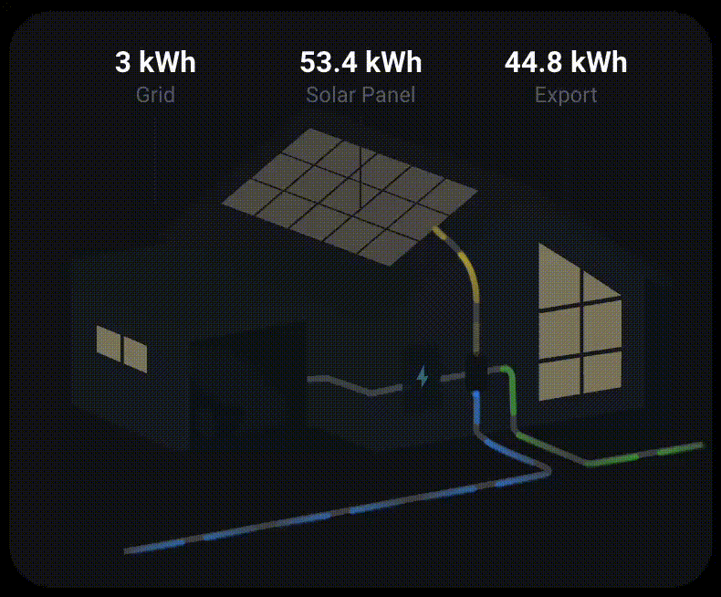
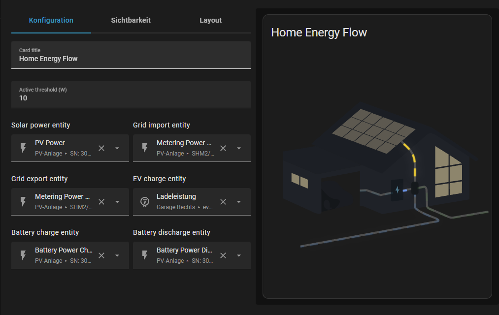

# Power Flow Card for Home Assistant



A custom Lovelace card for visualizing real-time energy flow between grid, solar, battery, and home.  

---

## Features

- Animated flow lines with gradient shine and dynamic speed  
- Top labels with live values for Grid, Solar Panel, and Export  
- Supports grid import/export, solar generation, battery charge/discharge  
- Optional EV and battery entities  
- Optional daily grid import value (uses `last_period`)  
---

## Installation

### **NPM (for React/Vue/other frameworks)**

```bash
npm install power-flow-card-ha
```

Then import in your project:

```javascript
import 'power-flow-card-ha';
```

### **HACS (recommended for Home Assistant)**

1. Open **HACS → Frontend**
2. Add a custom repository: `https://github.com/Kokhungchan/power-flow`
3. Install and add the resource:
   - URL: `/hacsfiles/power-flow/power-flow-card.js`
   - Type: **JavaScript Module**

### **Manual**

1. Copy `power-flow-card.js` into `/config/www/`
2. Add the resource:
   - URL: `/local/power-flow-card.js`
   - Type: **JavaScript Module**

---

## Usage in React

### Basic Setup

```jsx
import React, { useEffect, useRef } from 'react';
import 'power-flow-card-ha';

function PowerFlowCard() {
  const cardRef = useRef(null);

  useEffect(() => {
    if (cardRef.current) {
      cardRef.current.setConfig({
        name: 'Home Energy Flow',
        threshold: 10,
        entities: {
          solar_power: 'sensor.solar_power',
          grid_import_power: 'sensor.grid_import',
          grid_export_power: 'sensor.grid_export',
        },
      });

      // Mock Home Assistant object
      cardRef.current.hass = {
        states: {
          'sensor.solar_power': { state: '2500', attributes: { unit_of_measurement: 'W' } },
          'sensor.grid_import': { state: '500', attributes: { unit_of_measurement: 'W' } },
          'sensor.grid_export': { state: '0', attributes: { unit_of_measurement: 'W' } },
        },
      };
    }
  }, []);

  return <power-flow-card ref={cardRef} />;
}

export default PowerFlowCard;
```

### With Custom Styling

```jsx
import React, { useEffect, useRef } from 'react';
import 'power-flow-card-ha';

function PowerFlowCard() {
  const cardRef = useRef(null);

  useEffect(() => {
    if (cardRef.current) {
      cardRef.current.setConfig({
        name: 'Energy Monitor',
        threshold: 10,
        entities: {
          solar_power: 'sensor.solar_power',
          grid_import_power: 'sensor.grid_import',
          grid_export_power: 'sensor.grid_export',
          battery_charge_power: 'sensor.battery_charge',
          battery_discharge_power: 'sensor.battery_discharge',
        },
        styles: {
          'solar-color': 'orange',
          'grid-import-color': '#00aaff',
          'battery-color': 'purple',
          'card-background': '#2a2a2a',
          'header-font-size': '20px',
        },
      });

      cardRef.current.hass = {
        states: {
          'sensor.solar_power': { state: '3000', attributes: { unit_of_measurement: 'W' } },
          'sensor.grid_import': { state: '200', attributes: { unit_of_measurement: 'W' } },
          'sensor.grid_export': { state: '500', attributes: { unit_of_measurement: 'W' } },
          'sensor.battery_charge': { state: '1000', attributes: { unit_of_measurement: 'W' } },
          'sensor.battery_discharge': { state: '0', attributes: { unit_of_measurement: 'W' } },
        },
      };
    }
  }, []);

  return <power-flow-card ref={cardRef} />;
}

export default PowerFlowCard;
```

### With Real-time Updates

```jsx
import React, { useEffect, useRef, useState } from 'react';
import 'power-flow-card-ha';

function PowerFlowCard({ solarPower, gridImport, gridExport }) {
  const cardRef = useRef(null);

  useEffect(() => {
    if (cardRef.current) {
      cardRef.current.setConfig({
        name: 'Live Energy Flow',
        threshold: 10,
        entities: {
          solar_power: 'sensor.solar_power',
          grid_import_power: 'sensor.grid_import',
          grid_export_power: 'sensor.grid_export',
        },
      });
    }
  }, []);

  useEffect(() => {
    if (cardRef.current) {
      cardRef.current.hass = {
        states: {
          'sensor.solar_power': { state: String(solarPower), attributes: { unit_of_measurement: 'W' } },
          'sensor.grid_import': { state: String(gridImport), attributes: { unit_of_measurement: 'W' } },
          'sensor.grid_export': { state: String(gridExport), attributes: { unit_of_measurement: 'W' } },
        },
      };
    }
  }, [solarPower, gridImport, gridExport]);

  return <power-flow-card ref={cardRef} />;
}

export default PowerFlowCard;
```

### TypeScript Support

```tsx
import React, { useEffect, useRef } from 'react';
import 'power-flow-card-ha';

interface PowerFlowCardElement extends HTMLElement {
  setConfig: (config: any) => void;
  hass: any;
}

function PowerFlowCard() {
  const cardRef = useRef<PowerFlowCardElement>(null);

  useEffect(() => {
    if (cardRef.current) {
      cardRef.current.setConfig({
        name: 'Home Energy Flow',
        threshold: 10,
        entities: {
          solar_power: 'sensor.solar_power',
          grid_import_power: 'sensor.grid_import',
          grid_export_power: 'sensor.grid_export',
        },
      });

      cardRef.current.hass = {
        states: {
          'sensor.solar_power': { state: '2500', attributes: { unit_of_measurement: 'W' } },
          'sensor.grid_import': { state: '500', attributes: { unit_of_measurement: 'W' } },
          'sensor.grid_export': { state: '0', attributes: { unit_of_measurement: 'W' } },
        },
      };
    }
  }, []);

  return <power-flow-card ref={cardRef} />;
}

export default PowerFlowCard;
```

---

## Configuration 

Usage example in YAML:

```yaml
type: custom:power-flow-card
name: Home Energy Flow
threshold: 10
entities:

  solar_power: sensor.sn_3015027172_pv_power
  grid_import_power: sensor.sunny_home_manager_2_metering_power_absorbed
  grid_export_power: sensor.sunny_home_manager_2_metering_power_supplied
  grid_import_daily: sensor.grid_import_daily

  # Optional
  ev_charge_power: sensor.evcc_garage_charge_power
  battery_charge_power: sensor.sn_3017444296_battery_power_charge_total
  battery_discharge_power: sensor.sn_3017444296_battery_power_discharge_total

# Optional: Custom styles
styles:
  solar-color: "orange"
  grid-import-color: "#00aaff"
  battery-color: "purple"
  card-background: "#2a2a2a"
  header-font-size: "20px"
```

### Available Style Options

```yaml
styles:
  # Flow line colors
  solar-color: "gold"              # Solar flow line color
  grid-import-color: "dodgerblue"  # Grid import line color
  grid-export-color: "limegreen"   # Grid export line color
  battery-color: "cornflowerblue" # Battery line color
  ev-color: "deepskyblue"         # EV charging line color
  
  # Card styling
  card-background: "#1c1c1c"      # Card background color
  card-border-radius: "8px"       # Card border radius
  card-padding: "16px"            # Card padding
  card-shadow: "0 2px 8px rgba(0,0,0,0.3)" # Card shadow
  
  # Header styling
  header-font-size: "18px"        # Header font size
  header-font-weight: "600"       # Header font weight
  header-color: "#fff"            # Header text color
  
  # Label styling
  label-value-font-size: "16px"   # Label value font size
  label-text-font-size: "12px"    # Label text font size
```

Configuration editor screenshot:



## Credits

Based on and inspired by the original work: https://github.com/LordGuenni/power-flow-card

The Illustrator Base for the SVGs was provided by [ForsakenConversation](https://www.reddit.com/user/ForsakenConversation/)
